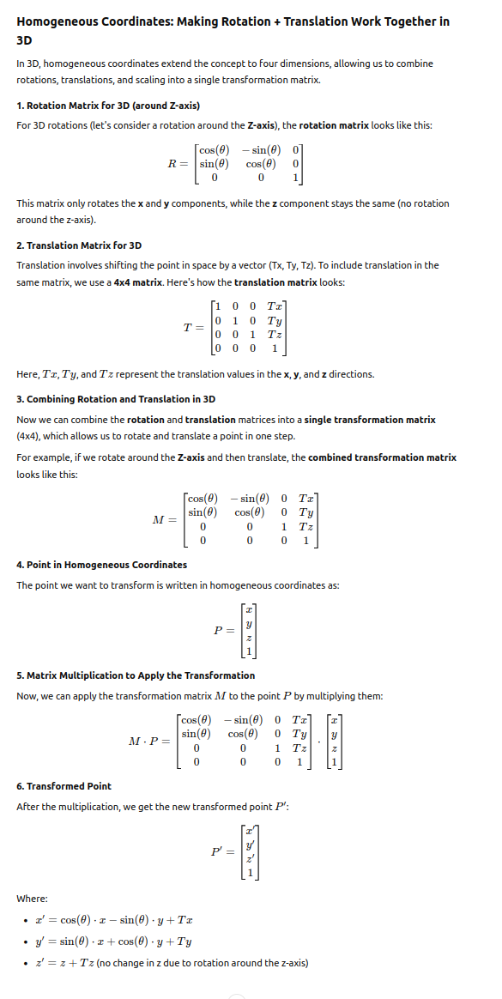

# 5th

## Loeng 5

**Viga slaididel:** Kuna nüüd kasutatakse `autoware_mini/msg`, siis peaks 3., 8. ja 9. slaidi joonisel olema hoopis `autoware_mini/msg/DetectedObjectArray`.

**Viga slaididel:** Rosis kasutatakse `final_objects` asemel `tracked_objects`. See mõjutab slaide 19, 26 ja 38.

**Viga slaidil:** Rvizis on center ja front `points_raw` tõstetud vastavalt kohtadesse `Sensing/Points raw center` ja `Sensing/Points raw front`. See mõjutab slaidi 38.

**Q:** Mida tähendab 39. slaidil lidar_sfa? Kas see tähendab seda, et lidari puhul kasutatakse objektide tuvastamisel närvivõrku klasterdamise asemel?

**Q:** Kas `autoware_mini` puhul kasutatakse kiiruse ennustamise puhul pigem närvivõrku või naiivset meetodit?

**Q:** Kui suurel määral võetakse objektide tuvastamisel arvesse kolme sensori tulemusi? Saan nii aru, et kolmemõõtmelist tee hetkeseisu saab näha a)Lidari abil ja  b)kaamerapildi ja radari kombineerimisel. Ehk kui palju võetakse objektide tuvastamisel arvesse meetodit a) ning kui palju meetodit b)? Oletan, et b) on natuke ilmastikukindlam (radari puhul ei ole vahet, kas on udu või sajab vihma või sajab lund, kuid kaamerapilti mõjutab see ikkagi oluliselt, kuid ehk natuke vähem kui lidarit?).

## Praktikum 5

**Viga juhendis:** Samad vead, mis slaididel seoses `autoware_mini/msg` kasutamisega.

**Bug:** `practice_5.launch` failist on puudu:
`<arg name="enable_auto_stop_checker"    default="true" />`
ning
`<param name="enable_auto_stop_checker" value="$(arg enable_auto_stop_checker)" />`

**Bug:** Kuna `autoware_mini` repos ei eksisteeri enam faili `ground_removal.py` (viskas seetõttu ka errori, kui tegin `roslaunch`), siis otsustasin selle asendada `naive_ground_removal.py` failiga (oletan, et prakside raames ei kasutata `jcp_ground_removal.py` varianti). Kuna `naive_ground_removal.py` nõuab ka mitmeid teistsuguseid parameetreid võrreldes juhendis antud `detection.yaml` failiga, siis otsustasin `practice_5.launch` failis viidata `autoware_mini` enda `detection.yaml` failile (ehk ei kasuta juhendis etteantud varianti). Selle jaoks muutsin `detection` nimeruumi `launch` failis järgmiseks:

``` launch
<!-- Detection -->
<group ns="detection">
    <group ns="lidar">
        <!-- Ground removal -->
        <group ns="center">
            <node type="naive_ground_removal.py" name="naive_ground_removal" pkg="autoware_mini" output="screen" required="true">
                <remap from="points_raw" to="/lidar_center/points_raw" />
            </node>
        </group>
        <!-- Filtering -->
        <node pkg="nodelet" type="nodelet" name="pcl_manager" args="manager" output="screen" required="true" />
        <node pkg="nodelet" type="nodelet" name="voxel_grid_filter" args="load pcl/VoxelGrid pcl_manager" output="screen" required="true">
            <remap from="~input" to="/detection/lidar/center/points_no_ground" />
            <remap from="~output" to="/detection/lidar/points_filtered" />
        </node>
        <!-- Point clusterer -->
        <node pkg="autoware_mini_practice_solutions" type="points_clusterer.py" name="points_clusterer" output="screen" required="true" />

        <node pkg="autoware_mini_practice_solutions" type="cluster_detector.py" name="cluster_detector" output="screen" required="true" />
        <!-- Visualizer -->
        <node pkg="autoware_mini" type="detected_objects_visualizer.py" name="detected_objects_visualizer" output="screen" required="true" />

    </group>
    <!-- Config -->
    <!-- <rosparam command="load" file="$(find autoware_mini_practice_solutions)/config/detection.yaml"/> -->
    <rosparam command="load" file="$(find autoware_mini)/config/detection.yaml"/>

</group>
```

**Viga juhendis:** 3. sektsioonis on `cluster_epsilon` ja `cluster_min_size` lingid vigased.

**Bug:** 5. sektsiooni näidiskoodis peaks importima `DetectedObjectArray` ja `DetectedObject` hoopis `autoware_mini.msg`-ist.

Läks üksjagu aega, et aru saada, mida ja miks tehakse 5. sektsioonis. Võib-olla võiks seal selguse huvides lahti seletada, miks need maatriksi tehted siin vajalikud on. Tõsi ta on, et mingit osa võib-olla seletati ka Kõrgem Matemaatika 1 kursuses, kuid ajapikku võib seal õpitu ununeda. ChatGPT seletas selle päris hästi lõpuks lahti:



**Viga juhendis:** Seoses `DetectedObject` muutustega, peaksid juhendis olevad lisaparameetrid 6. setsiooni 5. alapunktis olema antud hoopis sellised:

``` python
obj.id = label
obj.label = "unknown"
obj.color = BLUE80P
obj.valid = True
obj.position_reliable = True
obj.velocity_reliable = False
obj.acceleration_reliable = False
```
